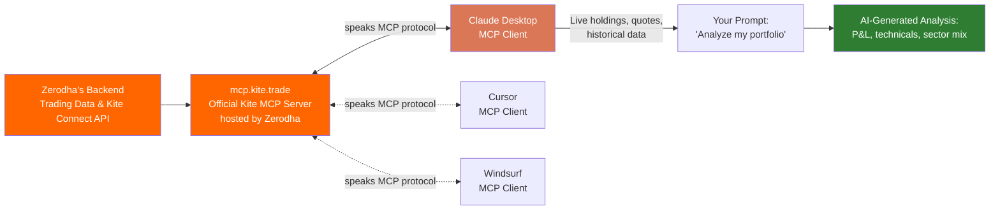
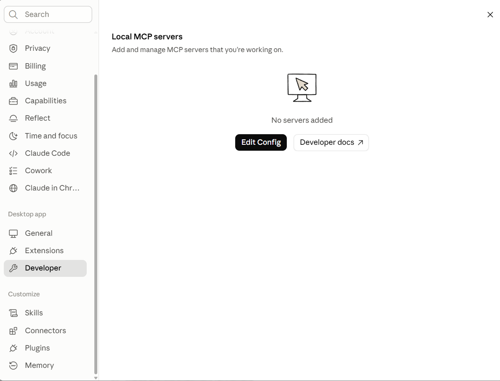
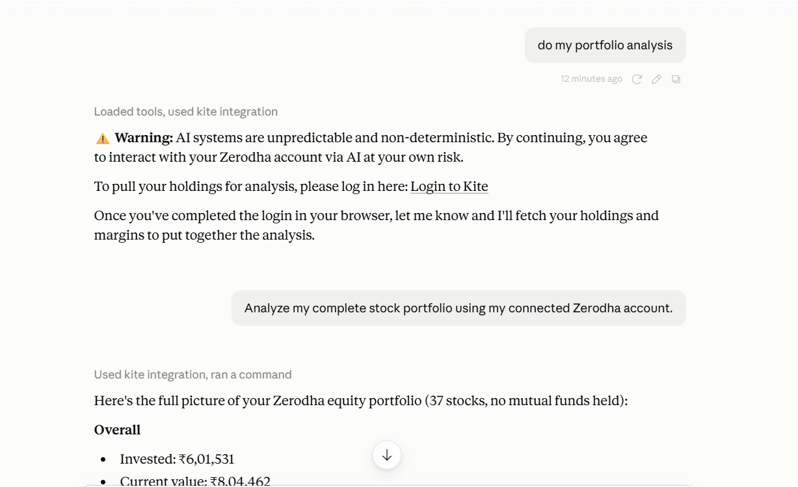

# Connecting Zerodha Kite to Claude Desktop via MCP

A step-by-step guide to connect your **Zerodha Kite** trading account to **Claude Desktop** using the **Model Context Protocol (MCP)** — so you can ask Claude to pull your live holdings, positions, and market data, and get AI-assisted portfolio analysis in plain English.

> ⚠️ **Disclaimer:** This guide is for educational purposes only. Connecting an AI model to a live trading account carries real risk — AI systems are non-deterministic and can misread data or make mistakes. Nothing produced through this setup is financial advice. Never use it to place trades unattended, and always verify important numbers independently. Use at your own risk.

---

## Table of Contents

- [The Problem](#the-problem)
- [The Solution](#the-solution)
- [Architecture](#architecture)
- [Prerequisites](#prerequisites)
- [Setup Steps](#setup-steps)
- [Verifying the Connection](#verifying-the-connection)
- [Example Prompts](#example-prompts)
- [Troubleshooting](#troubleshooting)
- [Safety Notes](#safety-notes)
- [License](#license)

---

## The Problem

Large language models like Claude are powerful at analysis and reasoning, but by default they have **no live connection to your actual financial data**. That creates a few real problems if you want AI help with your portfolio:

- **No real-time context.** Claude doesn't know what stocks you hold, at what price, or how they've moved today — it can only work from what you manually type in.
- **Manual copy-pasting is slow and error-prone.** Pulling holdings, P&L, and market quotes by hand and pasting them into a chat is tedious and easy to get wrong, especially across 20-30+ holdings.
- **Stale analysis.** Static, copy-pasted data goes out of date the moment the market moves — any analysis built on it is already outdated.
- **No live market data for technicals.** Reasonable technical analysis (moving averages, RSI, support/resistance) needs actual historical price series, which isn't something you can hand-type accurately.

In short: **AI analysis is only as good as the data behind it — and without a live connection, that data is missing, stale, or manually assembled.**

## The Solution

**Claude Desktop + MCP + Zerodha Kite** closes this gap.

[**MCP (Model Context Protocol)**](https://modelcontextprotocol.io) is an open standard that lets AI applications like Claude connect securely to external tools and data sources. Zerodha exposes an official **Kite MCP server**, which means Claude can — with your explicit login and consent — directly call Zerodha's APIs to:

- Fetch your current holdings, positions, and margins
- Pull live quotes and historical price data for any instrument
- Place, modify, or cancel orders (if you choose to allow it)

Once connected, you can simply ask Claude things like *"analyze my portfolio"* or *"what's the RSI on TCS?"* in plain language, and it fetches real data before answering — no manual data entry required.

## Architecture



**How to read this:** The two Zerodha-owned boxes on the left ("Zerodha's Backend" and "mcp.kite.trade") are both Zerodha's own infrastructure — the backend holds the raw trading data, and `mcp.kite.trade` is the specific server Zerodha built and hosts to expose that data using the **MCP protocol**. MCP itself isn't a separate service data passes *through* — it's the shared language that lets any compatible AI client (Claude, Cursor, Windsurf) talk to that server directly, the same way HTTP is the language browsers use to talk to websites. This guide sets up the connection between the Kite MCP Server and Claude Desktop; the dashed lines to Cursor and Windsurf just show the same server works with other MCP clients too, if you use them.

## Prerequisites

| Requirement | Link |
|---|---|
| Claude Desktop app | [claude.com/download](https://claude.com/download) |
| Node.js (required to run the MCP connector) | [nodejs.org/en/download](https://nodejs.org/en/download) |
| An active Zerodha Kite trading account | [kite.zerodha.com](https://kite.zerodha.com) |
| *(Reference)* Official Kite MCP Server source & docs | [github.com/zerodha/kite-mcp-server](https://github.com/zerodha/kite-mcp-server) |

---

## Setup Steps

### Step 1: Open Claude Desktop
Launch the **Claude Desktop** application on your computer.

### Step 2: Open Settings
Click your **Profile icon** → select **Settings**.

### Step 3: Open Developer Settings
- In the left sidebar, click **Developer**.
- Click **Edit Config**.

This opens the `claude_desktop_config.json` file for editing.


*The Developer tab, before any MCP servers are added.*

### Step 4: Edit the Configuration File

Open `claude_desktop_config.json` in **Notepad** (Windows) or any plain-text editor, delete all existing content, and replace it with:

```json
{
  "mcpServers": {
    "kite": {
      "command": "npx",
      "args": [
        "mcp-remote",
        "https://mcp.kite.trade/mcp"
      ]
    }
  }
}
```

Save the file and close the editor.

> If you already have other MCP servers configured, add `"kite"` as an additional entry inside the existing `"mcpServers"` object instead of replacing the whole file.

### Step 5: Restart Claude Desktop

Simply closing the window is **not enough** — the app needs a full restart to pick up the config change.

- Click **File → Exit** to fully quit the application.
- Reopen **Claude Desktop**.

### Step 6: Verify the Connection

- Go back to **Settings → Developer**.
- You should now see **kite** listed as a Local MCP server with status **Running**.

### Step 7: Log In When Prompted

The first time you ask Claude to use your Zerodha data, it will trigger a login flow:

- Claude will show a warning that AI interactions with your account carry inherent risk, plus a **Login to Kite** link.
- Click the link, complete the standard Zerodha login (including 2FA) in your browser.
- Return to Claude and confirm — it will then fetch your data.

## Verifying the Connection

Here's what a successful first run looks like in practice:


*Asking Claude to analyze a portfolio — it prompts for Kite login, then fetches real holdings once authorized.*

## Example Prompts

Once connected, here are prompts that work well:

**Portfolio overview**
```
Do my portfolio analysis.
Analyze my complete stock portfolio using my connected Zerodha account.
```

**Deeper, structured analysis**
```
For each holding, give me quantity, average buy price, current price,
P&L (₹ and %), and portfolio weight. Classify each as Strong / Average /
Underperformer and explain the trend, support/resistance, RSI, and
volume pattern.
```

**Single-stock technicals**
```
What's the current RSI and trend for TCS?
Show me support and resistance levels for INFY over the last month.
```

**Portfolio-level risk questions**
```
What's my sector-wise allocation?
Do I have any concentration risk in my portfolio?
Which of my holdings have been underperforming for a while?
```

**Market/sector research** *(uses Claude's web search alongside your Kite data — not a recommendation engine)*
```
What's the current outlook for the banking sector in India?
Pull live quotes for [stock names] and show me their recent trend.
```

> 💡 **Tip:** Be specific about what you want (fields, time period, format). Claude will fetch the live data it needs via Kite before responding — you don't need to paste any numbers yourself.

## Troubleshooting

| Issue | Fix |
|---|---|
| `kite` server not showing in Developer settings | Confirm the JSON is valid (no trailing commas, correct braces) and that you fully restarted the app (File → Exit, not just closing the window) |
| "Please log in first" error when calling a tool | Run the login flow again — Kite sessions expire periodically and need re-authorization |
| `npx` command not found | Install [Node.js](https://nodejs.org/en/download) — `npx` ships with it |
| Config file changes not taking effect | Double-check you edited the file opened via **Settings → Developer → Edit Config**, not a different copy |

## Safety Notes

- **This connection can read your live trading data and, depending on the tools invoked, place or modify orders.** Only use it with an account and risk tolerance you're comfortable with.
- **Never treat AI output as investment advice.** Use it to speed up data-gathering and analysis, not to replace your own judgment or a licensed financial advisor.
- **Double-check anything before acting on it** — especially prices, quantities, and order-related actions.
- Log out / revoke the Kite session if you're not actively using it.

## References & Further Reading

- **Official Kite MCP Server (GitHub)** — source code, self-hosting instructions, license: [github.com/zerodha/kite-mcp-server](https://github.com/zerodha/kite-mcp-server)
- **Zerodha's official announcement** — Z-Connect blog post introducing Kite MCP: [zerodha.com/z-connect/featured/connect-your-zerodha-account-to-ai-assistants-with-kite-mcp](https://zerodha.com/z-connect/featured/connect-your-zerodha-account-to-ai-assistants-with-kite-mcp)
- **Zerodha Support article** — official setup + security notes: [support.zerodha.com — Connect Zerodha to AI assistants](https://support.zerodha.com/category/trading-and-markets/general-kite/others-kite/articles/connect-zerodha-ai-assistant)
- **Kite Connect API docs** — underlying API reference: [kite.trade/docs/connect](https://kite.trade/docs/connect/)
- **Model Context Protocol (MCP) — official spec**: [modelcontextprotocol.io](https://modelcontextprotocol.io)
- **Claude Desktop**: [claude.com/download](https://claude.com/download)
- **Node.js** (required for `npx`): [nodejs.org/en/download](https://nodejs.org/en/download)

> Per Zerodha's own documentation, the hosted `mcp.kite.trade` endpoint **excludes potentially destructive trading operations** (like placing live orders) for security — it's scoped to data retrieval and analysis. For advanced/self-hosted setups with full trading capability, see the official GitHub repo above.

## License

This guide is shared for educational purposes. Feel free to fork, adapt, and share — attribution appreciated.

---

*Have questions or improvements? Open an issue or PR on this repo.*
